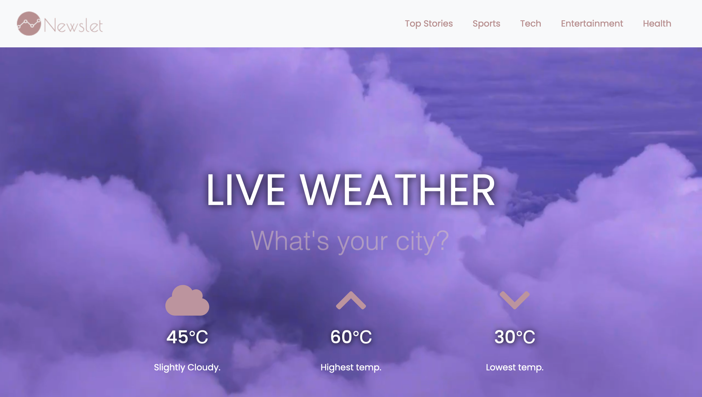

# Newslet
### Description:

Newslet will display up-to-date top headlines in the news from various publications, as opposed to only one, and links to access the articles and read them. Newslet will allow users to receive the news sorted in categories including sports, technology, entertainment and health. On the homepage, a user may view the weather, learn more about the team , the technologies used to build the application, our future plans of features to integrate into the application and a fun game will also be displayed for the users convenience/amusement. 

### Figma Wireframe: <a href="https://www.figma.com/file/Cf37xsXwXkxhSoi3lQhNKb/TKH_Final_Project?node-id=0%3A1">Link to Figma Wireframe</a>

### Technology Used
### API’s Used:
  <ul>
    <li><a href="http://newsapi.org" target="_blank">News API</a></li>
    <li><a href="https://openweathermap.org/api" target="_blank">OpenWeather API</a></li>
    <li><a href="https://api.adviceslip.com/" target="_blank">AdviceSlip API</a></li>
  </ul>

Built With: HTML, CSS, Bootstrap, Javascript

Contributors: Leesel Fraser & Zipporah Najar

| Contributor | Github | Linkedin | 
|:--- |:---- |:----:|
|1. Leesel | <a href="github.com/leesel" target="_blank">Github</a> | <a href="linkedin.com/in/leesel" target="_blank">Linkedin</a> |
|2. Zipporah| <a href="github.com/zeita101" target="_blank">Github</a> | <a href="linkedin.com/" target="_blank">Linkedin</a> |
